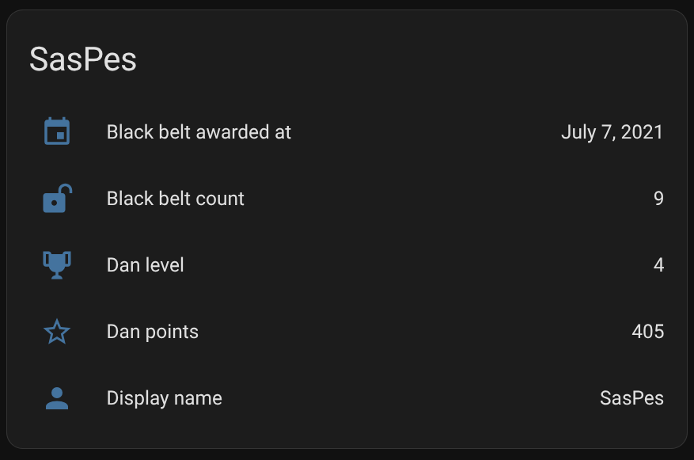
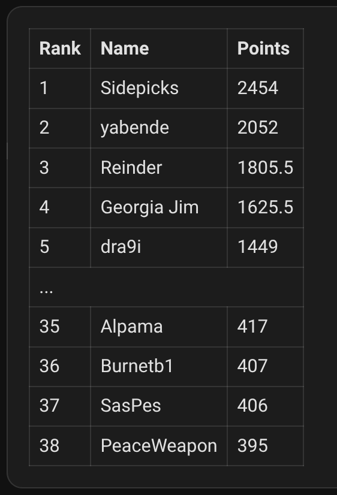

# LPU Belts HA

[](https://hacs.xyz/)


Custom integration for Home Assistant to show LPU Belts leaderboard data




## Features

- Fetches and displays user metrics from the LPU Belts leaderboard
- Provides info for dan level, points, black belt count, and more
- Diagnostic info for API connectivity and last update time

## Installation (HACS)
- Add this repository to HACS as a custom repository, category: `integration`
- Install the `LPU Belts HA` integration
- Restart Home Assistant

## Manual Installation

1. **Download the integration:**
   - Clone or download this repository
   - Extract the `lpubelts_ha` folder from `custom_components`

2. **Place files in Home Assistant:**
   ```bash
   cp -r custom_components/lpubelts_ha ~/.homeassistant/custom_components/
   ```
   Or manually copy the `lpubelts_ha` folder to `<config>/custom_components/` where `<config>` is your Home Assistant configuration directory

3. **Restart Home Assistant:**
   - Go to Settings → System → Restart Home Assistant
   - Or restart via command line: `sudo systemctl restart home-assistant@homeassistant`

## Configuration
- Go to Settings → Devices & Services → Add Integration → `LPU Belts HA`
- Enter your `Name` exactly as it appears on the LPUBelts leaderboard

## Sensors

- Display name
- Dan level
- Dan points
- Black belt count
- Black belt awarded at
- Position
- Ranking

## Diagnostics

- API connectivity status
- Last updated time

## Dashboard card example

Use this in a Home Assistant Markdown card to render the leaderboard



```html
<table>
  <thead>
    <tr>
      <th>Rank</th>
      <th>Name</th>
      <th>Points</th>
    </tr>
  </thead>
  <tbody>
    
    
      
        <tr>
          <td colspan="3" style="text-align:center;">...</td>
        </tr>
      
        
        
          
          
          
          
          <tr>
            <td>{{ rank }}</td>
            <td>{{ name }}</td>
            <td style="text-align:right;">{{ points }}</td>
          </tr>
        
      
    
  </tbody>
</table>
```

## Local Development

### Prerequisites

- Python 3.11 or higher
- Docker (for Docker setup)
- Home Assistant development environment

1. **Start Home Assistant container:**
   ```bash
   mkdir -p /home/$USER/ha-test-lpu/config/custom_components/lpubelts_ha/
   
   docker run -d \
     --name ha-test-lpu \
     --privileged \
     -p 8123:8123 \
     -v /home/$USER/ha-test-lpu/config:/config \
     ghcr.io/home-assistant/home-assistant:stable
   ```
2. **Deploy integration to container:**
   ```bash
   cp -r custom_components/lpubelts_ha/* /home/$USER/ha-test-lpu/config/custom_components/lpubelts_ha/ && docker restart ha-test-lpu
   ```
3. **Access Home Assistant:**
   ```
   Open http://localhost:8123 in your browser
   ```