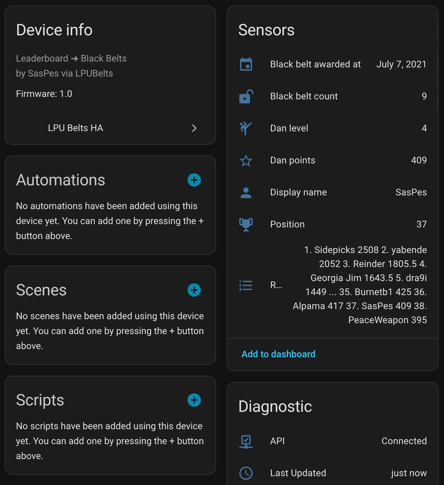

# LPU Belts HA

A Home Assistant integration for displaying LPU Belts leaderboard data.



## Features

- Fetches and displays user metrics from the LPU Belts leaderboard
- Provides info for dan level, points, black belt count, and more
- Diagnostic info for API connectivity and last update time

## Installation

1. Copy the `lpubelts_ha` directory to your Home Assistant `custom_components` folder
2. Restart Home Assistant

## Configuration

1. Go to **Settings** > **Devices & Services** > **Add Integration**
2. Search for **LPU Belts HA**
3. Enter your LPU Belts display name

## Sensors

- Display name
- Dan level
- Dan points
- Black belt count
- Black belt awarded at

## Diagnostics

- API connectivity status
- Last updated time

## Local Development

### Prerequisites

- Python 3.11 or higher
- Docker (for Docker setup)
- Home Assistant development environment

1. **Start Home Assistant container:**
   ```bash
   mkdir -p /home/$USER/ha-test-lpu/config/custom_components/lpubelts_ha/
   
   docker run -d \
     --name ha-test-lpu \
     --privileged \
     -p 8123:8123 \
     -v /home/$USER/ha-test-lpu/config:/config \
     ghcr.io/home-assistant/home-assistant:stable
   ```
2. **Deploy integration to container:**
   ```bash
   cp -r custom_components/lpubelts_ha/* /home/$USER/ha-test-lpu/config/custom_components/lpubelts_ha/ && docker restart ha-test-lpu
   ```
3. **Access Home Assistant:**
   ```
   Open http://localhost:8123 in your browser
   ```